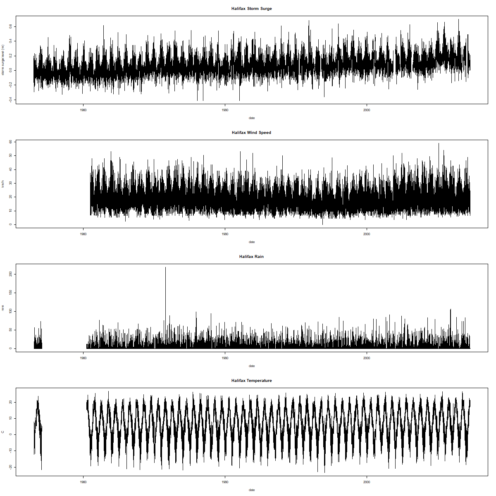
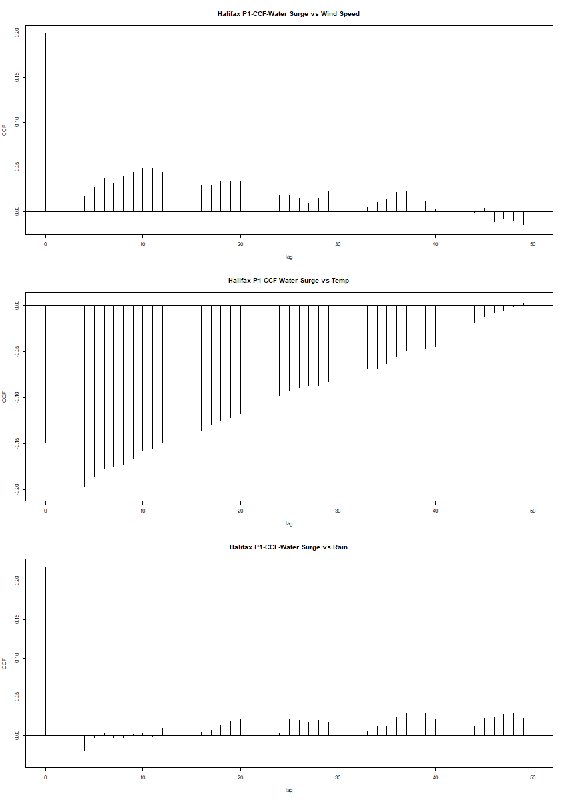
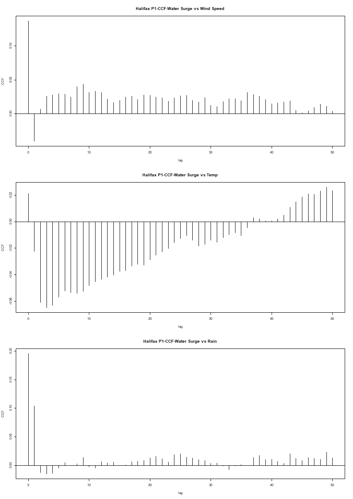
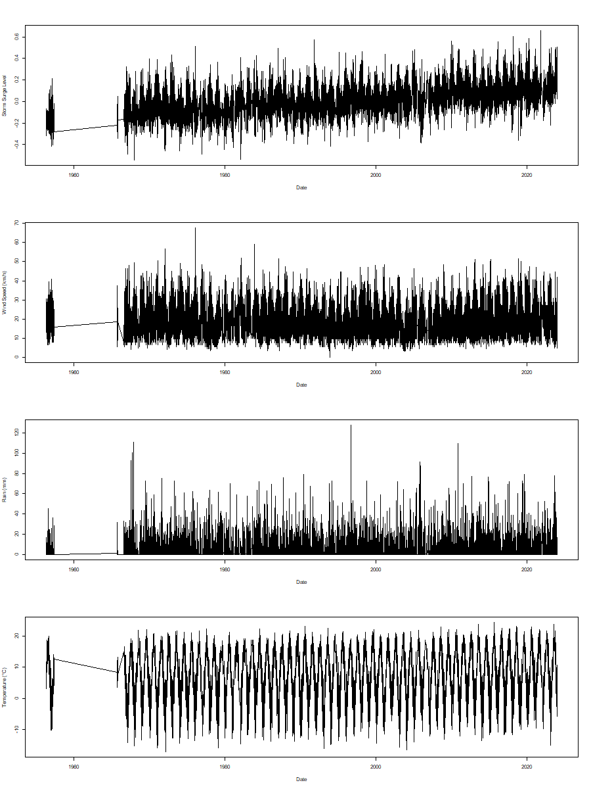

\begin{center}
  \vspace{-5mm}
    \href{https://github.com/KyleA2001/STAT4620\_5620-Flooding\_Project.git}{ https://github.com/KyleA2001/STAT4620\_5620-Flooding\_Project.git}
\end{center}

\newpage

# Abstract

Summary in 150 words (Best done last, summarizes the whole project)

# Keywords

- Storm Surge
- Generalized Additive Mixed Models (GAMMs)
- Autocorrelation Function (ACF)
- Cross-Correlation Function (CCF)
- Vector Autoregression (VAR)
- Extreme Value Analysis (EVA)

# 1. Introduction

Storm surges are one of the most significant geophysical risks affecting coastal regions, often leading to substantial loss of life and property.^[@R-Vonstorch2008] They occur when strong winds and low atmospheric pressure cause an abnormal rise in sea level, pushing water onto the shore. As coastal populations and infrastructure expand, vulnerability to storm surges is increasing, contributing to a growing crisis in urbanized coastal areas where natural hazards are causing unprecedented damage.^[@R-Helderop2019]

Nova Scotia, with its extensive coastline along the Atlantic Ocean, is particularly susceptible to storm surges, which frequently exacerbate flooding events. Over the past decade, the province has experienced an increase in extreme weather conditions, including heavy rainfall and strong winds, resulting in catastrophic floods that have damaged infrastructure, displaced communities, and disrupted ecosystems .^[@R-Childs2017] As climate change intensifies these weather patterns, understanding the climatic drive.^[@R-Simonovic2012]

Storm surge is influenced by multiple meteorological and oceanographic factors, the main factor is wind speed but others have been identified like atmospheric pressure, temperature, and rainfall playing key roles.^[@R-Resio2008] Prior studies have shown that wind speed is a main driver of storm surge height. Rising sea surface temperatures have also been linked to stronger storm systems, leading to more intense surges.^[@R-Needham2015] While heavy rainfall contributes to overall flood risk, its direct correlation with storm surge is less pronounced compared to wind and pressure effects.^[@R-Fang2021]

Modeling these extreme weather events can be challenging due to their rarity and the complex way multiple climatic factors may interact.  Although flooding events are relatively infrequent, their impact can cause significant societal and economic damage, highlighting the need for improved analysis and forecast tools. This research seeks to understand the relationship between various climatic factors and storm surge levels at selected locations in Nova Scotia including Halifax and Yarmouth. Then these findings are used to forecast the likelihood of future flooding events based on the most significant contributing climatic factor.

This study aims to model storm surge levels in Nova Scotia by using wind speed, temperature, and rainfall as covariates. Our objectives are:

1.	To analyze the relationship between various climatic factors and storm surge levels across Nova Scotia.
2.	To predict future flooding events by using the most significant correlated factor.

By identifying key predictors of storm surge, this research enhances our understanding of how climatic factors contribute to flooding disasters and supports the development of improved forecasting models, helping communities mitigate the risks associated with extreme coastal flooding.

# 2. Data 

## 2.1 Description

The data were collected over time from Environment and Climate Change Canada, the Citizen Weather Observer Program (CWOP), and the Government of Canada. Specifically, water level data were obtained from the Government of Canada, while the other variables were sourced from the remaining two organizations. The storm surge level was then calculated using the collected water level data. 

Data were collected for two locations: from January 1961 to August 2014 for Halifax, and from May 1956 to December 2023 for Yarmouth. Due to limitations in the available data within the examined time frame and insights from other researchers, three covariates were selected for analysis: air temperature, wind speed, and rainfall. A description of these covariates is provided below:

```{=latex}
\begin{table}[h]
\centering
\resizebox{\textwidth}{!}{ % Resizes the table to fit the width of the page
\begin{tabular}{|c|c|c|c|}
\hline
\textbf{Variables} & \textbf{Units} & \textbf{Description} & \textbf{Frequency} \\
\hline
Date & days & Date when data was recorded & Daily \\
Location & & Halifax and Yarmouth &  \\
Water Level & m (meters) & Height above datum or reference system & Hourly \\
Storm Surge & m (meters) & Water rise due to water level and tide height & Hourly \\
Air Temperature & °C & Air temperature & Daily min/max/avg \\
Wind Speed & km/h & Wind speed & Daily min/max/avg \\
Rainfall & mm & Precipitation (not including snow) & Real daily value \\
\hline
\end{tabular}
}
\caption{Data description summary}
\end{table}
```

## 2.2 Data Pre-processing

Storm surge is a critical value in flood and storm impact analysis, but it cannot be directly observed. Instead, it must be calculated using the following formula:

$$
\text{Storm Surge} = \text{Observed Water Level} - \text{Fitted Tide}
$$

The observed water level is obtained from archived data provided by the Government of Canada. This data was measured at two separate locations: Halifax and Yarmouth. The fitted tide uses the function `ftide`, where it fits the tidal data using any set of harmonic constituents. This function takes in three main components:

- `x`: A numeric vector object giving the water levels; it allows for missing values.

- `dto`: A date vector of same length as `x` which should be a `POSIXct` object; it does
not allow for missing values.

- `hcn`: A vector of constituent names. Here, we specify only the 4 major harmonic constituents, `hc4`.

By applying this function to the observed water levels, the predicted storm surge values can be calculated. This function allows for the accurate estimation of storm surge at the specified locations based on tide and observations water levels.

**Missingness Interpolation**

In this study, linear interpolation was used to fill in missing values for the covariates. This method estimates missing values between two known data points by assuming a linear change between them. Suppose there are two known data points ($t_1, y_1$) and ($t_2, y_2$), and we aim to estimate the value at some point $t$ where $t_1<t<t_2$. The interpolated value is given by 

$$y(t)=y_1+\frac{y_2-y_1}{t_2-t_1}\times (t-t_1)$$


A cutoff of 15 days was applied, meaning that gaps of 15 days or fewer were interpolated using this method, while longer gaps were left untreated. However, linear interpolation assumes a constant rate of change between data points, which may oversimplify real-world variability, potentially smoothing over short-term fluctuations and underestimating uncertainty in the data.

In this analysis, daily average values of storm surge levels are computed and used alongside the corresponding daily average values of wind speed and temperature. The daily storm surge level and its associated covariates for Halifax are presented in @tbl-ts_halifax below. From the plots, it appears that storm surge level and wind speed exhibit a similar pattern, especially when compared to the other two variables. The corresponding visualization for Yarmouth is provided in @fig-ts_yarmouth in the appendix. 

{width=80% #tbl-ts_halifax}

# 3. Methods

## 3.1 Auto- and Cross-correlation (ACF and CCF)

The auto-correlation function is a scaled version of the auto-covariance, that is used to understand the dependence structure of the time series process. It measures how current values of the time series are related to past values across various lags. The auto-correlation of a general time series ($X_t$) at lag $h$ is determined by 

$$\rho_X(h)=\frac{\text{Cov}(X_{t+h},X_t)}{\text{Var}(X_t)}=\frac{\gamma_X(h)}{\gamma_X(0)}$$

where $\gamma_X(h)$ is the auto-covariance function of the time series at lag $h$. 

The cross-correlation is used to evaluate the relationship between two time series at different lags. For two general time series ($X_t$) and ($Y_t$), the cross-correlation at lag $h$ is defined as

$$\rho_{XY}(h)=\frac{\text{Cov}(X_{t+h}, Y_t)}{\sqrt{\text{Var}(X_{t})\text{Var}(Y_t)}}=\frac{\gamma_{XY}(h)}{\sqrt{\gamma_X(0)\gamma_Y(0)}}$$

where $\gamma_{XY}(h)$ is the cross-covariance function of two time series at lag $h$.

In `R`, functions `acf()`, and `ccf()` in package `stats` can be use to compute and visualize the autocorrelation of a single time series and cross-correlation between two time series, respectively. 

## 3.2 Generalized Additive Mixed Models (GAMMs)

Generalized additive mixed effect models (GAMMs) are statistical models that combine the flexibility of Generalized Additive Models (GAMs) with the ability to account for random effects in mixed-effect models. Specifically, GAMMs capture non-linear relationships between predictors and the response variable by applying smooth functions to each predictor. Moreover, it also incorporates random effects to account for group or cluster-level variability in the data. The model is typically expressed as:

$$y_i=f_Y(y_i; \mu_i, \theta)$$
$$g(\mu_i)=X\beta+Zw+\sum_{i=k}^Kf_i(x_i)$$
$$w\sim N(0, \sigma^2)$$

where $f_Y$ is the distribution of the response variable, $g$ is the link function, $f_i$ is the smooth function, $X\beta$ is the fixed effects, $Zw$ is the random effects.

In addition, GAMMs assume smooth, additive relationships between predictors and the response, with random effects accounting for grouped or correlated data. In this study, both residuals and random effects are assumed to follow a normal distribution with constant variance, and the response variable is modeled as belonging to the exponential family. In `R`, the `mgcv` package provides the `gamm()` function, which fits GAMMs using the `nlme` package and allows for both non-linear predictor effects and random effects. Model diagnostics can be performed using the `mgcv::gam.check()` function.

## 3.3 Vector Autogressive (VAR)

A VAR model is a more generalized version of the univariate autoregressive model. It comprises one equation per variable in the system including a constant and lags of all of the variables in the system.

Consider $\mathbf{Y}_t$ be a $p\times 1$ vector of time series variables at time $t$. The VAR($k$) model is determined by 
$$
\mathbf{Y}_t=\beta_0+\Phi_1\mathbf{Y}_{t-1}+\Phi_2\mathbf{Y}_{t-2}+\dots + \Phi_k\mathbf{Y}_{t-k}+\epsilon_t
$$
where 

$\mathbf{Y}_t = [y_{1t}, y_{2t}, \dots, y_{pt}]^T$ is the vector of $p$ endogenous variables at time $t$, 

$\beta_0$ is a $p\times 1$ vector of intercept terms, 

$\Phi_i$ is a $p\times p$ matrix of autoregressive coefficients for lag $i=1, \dots, k$,

$\epsilon_t$ is a $p\times 1$ vector of error terms assumed to be white noise: $\epsilon_t\sim N(0, \Sigma_\epsilon)$, where $\Sigma_\epsilon$ is the $p\times p$ covariance matrix.

In `R`, the `VAR()` function from the vars package can be used to fit a VAR($k$) model for multivariate time series data (i.e., more than one time series). For a univariate time series, the `arima()` function from the `stats` package can be used to fit ARIMA models. 

To assess overfitting, rolling-origin cross-validation can be applied to a multivariate time series using a VAR model which can be visualized as the image below. At each step, the VAR model is trained on an expanding window of the training data, and $h$-step ahead forecasts are produced, where $h=1$ in Figure @fig-ts_CV. The forecast accuracy is then evaluated by comparing these predictions to the actual values of the chosen target variable.

{width=80% #fig-ts_CV}

## 3.4 Granger Causality 

Granger Causality is a statistical technique that determines whether one time series can predict another. In a VAR($k$) model with $p$ variables, variable `x` is said to Granger-cause variable `y` if the past values of `x` provide statistically significant information about the future values of `y` that cannot be explained by the past values of `y` itself. The test determines whether the coefficients for the lagged values of `x` are jointly significant in the equation for `y`.  If they are, we reject the null hypothesis, which holds that `x` does not cause `y`. However, it is important to note that Granger causality identifies predictive relationships rather than direct causal links.

Consider the system with only one target variable $y_t$ with $p$ explanatory variables $x_{1t}, x_{2t}, \dots, x_{pt}$ in VAR($k$) model as follows:
$$
y_t=\beta_0+\sum_{i=1}^k\alpha_iy_{t-i}+\sum_{j=1}^p\sum_{i=1}^k\beta_{ji}x_{j, t-i}+\epsilon_t
$$
where $\beta_0$ is an intercept, $\alpha_i$ are coefficients corresponding to the lagged of the target variable $y_t$, and $\beta_{ji}$ are coefficients for the lags of explanatory variables $x_j$ for $j=1, \dots, p$.

The test for Granger causality in the above model involves in whether a specific variable $x_j$ Granger-causes $y_t$, the null hypothesis is as follows:
$$H_0: \beta_{j1}=\beta_{j2}=\dots =\beta_{jk}=0$$

The rejection of the null hypothesis suggest that past values of $x_j$ contain predictive information about $y_t$ beyond what can be explained by the past values of $y_t$ alone or we can say $x_j$ Granger-causes $y_t$. In `R`, the function `vars::causality()` is commonly used to compute test statistics for Granger causality within the context of VAR($k$). Additionally, `the lmtest::grangertest()` function can be used to perform Granger causality tests in a more general (bivariate) setting.

## 3.5 Extreme Value Analysis (EVA)
Since we are interested in flooding incidents in the coast of Nova Scotia, we want to identify and model the extreme storm surge levels that are associated with such events. Extreme Value Analysis (EVA) is a statistical method used to assess, model, and predict the behavior of extreme events or rare occurrences. It seeks to assess the probability of events that are more extreme than any previously observed. These extreme events are often characterized by their low probability of occurrence but high potential for severe consequences. The EVA method utilized in the second research question is known as the Block Maxima (BM) approach. Simply, the BM analysis divides the observation period into non-overlapping periods of equal size $n$, known as blocks. Attention is restricted to the maximum observation in the block, known as the block maxima. In many contexts, it is common to see the block being set to a year, where our block maximas are annual maximas. These block maximas can be fitted to what is known as the Generalized Extreme Value (GEV) distribution.  Given we are working with two locations, Halifax and Yarmouth, we let $y_j$ be the vector holding the annual maximas for the $j^{th}$ location and is of length $N_j$, which is the number of years observed for location $j$. This $y_j$ vector contains the $y_{ji}$ values which represent the $i^{th}$ years annual maxima in the $j^{th}$ location. These annual maximas are assumed to follow the GEV distribution, and have the following information: 

$${y_{ji}} \sim GEV(\mu_j,\sigma_j,\xi_j), \text{for } i =1,2,\cdots, N_j, \mbox{ and } j = 1,2.$$
The density function for $y_{ji}$ is: 

$$g(y\mid \mu_j,\sigma_j,\xi_j) = \frac{1}{\sigma_j} \left\{1 + \xi_j \left(\frac{y - \mu_j}{\sigma_j}\right)\right\}\exp \left\{- \left[1 + \xi_j \left(\frac{y- \mu_j}{\sigma_j}\right)\right]^{-\frac{1}{\xi_j}}\right\}.$$
where $\mu_j,\xi_j \in \mathbb{R}$, $\sigma_j >0$, and,
$$y \in [ \mu_j - \frac{\sigma_j}{\xi_j}, \infty] \text{ if } \xi_j > 0,$$
$$y \in (-\infty,\infty)  \text{ if } \xi_j = 0,$$
$$y \in [\infty,  \mu_j + \frac{\sigma_j}{\xi_j}] \text{ if } \xi_j < 0.$$
Fitting the obtained annual maximas to the GEV is completed using the `gev.fit()` function in R, which takes in the vector of annual maximas to be fitted. Checking the fit of the GEV can be done by taking a look at using the `gev.diag()` function and ensuring that there are no alarming diversion from normality. Once the annual maximas are fitted using the GEV, we obtain maximum likelihood estimates (MLE) for the three parameters $\mu, \sigma, \xi$. These MLE estimates will be used to calculate corresponding return levels for different return periods. Return levels are quantification of risk and represent the level that is expected to be exceeded once on average in a given period, $\frac{1}{p}$. Return levels are notated as $z_p$ and are calculated as follows:

$$\hat z_p = \hat\mu - \frac{\hat\sigma}{\hat\xi} [1-y_p^{-\hat\xi}], \text{ } y_p = - \log(1-p) $$
There are ways of obtaining these return levels while incorporating covariates such as wind speed, for better estimation values. However, although it has been attempted to incorporate this using the covariate component of the `gev.fit()` function, as will be discussed in the Analysis section, it is suspected that the implementation is inaccurate or incorrect. Incorporating covariates does require a higher scope of study beyond this project. 

# 4. Analysis

In the following code, the Halifax location is used as an example, and a similar approach is applied to Yarmouth.

## 4.1 Question 1

**Auto-correlation functions** of each time series of climatic factors including storm surge, wind speed, temperature and rain are given below.

```{r eval=FALSE, tidy=TRUE}
# Storm surge
hf_acf_surge = acf(halifax$avg_water_surge, lag.max = 50, main="Halifax-ACF-Storm Surge")

# Wind speed
hf_acf_wind = acf(halifax$avg_wind_speed, lag.max = 50, main="Halifax-ACF-Wind Speed")

# Temperature
hf_acf_temp = acf(halifax$avg_temperature, lag.max = 50, main="Halifax-ACF-Temperature")

# Rain
hf_acf_rain = acf(halifax$rain, lag.max = 50, main="Halifax-ACF-Rain")
```

**Cross-correlation functions** of storm surge level and other climatic factors are 

```{r eval=FALSE, tidy=TRUE}
# Storm surge and Wind speed
hf_ccf_surge_wind = ccf(halifax$avg_water_surge, halifax$avg_wind_speed, lag.max = 50, plot=F)

# Storm surge and Temperature
hf_ccf_surge_temp = ccf(halifax$avg_water_surge, halifax$avg_temperature, lag.max = 50, plot=F)

# Storm surge and Rain 
hf_ccf_surge_rain = ccf(halifax$avg_water_surge, halifax$rain, lag.max = 50, plot=F)
```

**Generalized Additive Mixed Model** can be expressed by the following formula, where location is included as a random intercept:

$$
\text{storm\_surge}_i=\beta_0+\beta_1\text{temp}_i+\beta_2\text{wind\_speed}_i+\beta_3\text{rain}_i+f_1(\text{temp}_i)+f_2(\text{wind\_speed}_i)+f_3(\text{rain}_i)+f_4(t_i)+w_{g,i}+\epsilon_i
$$

where $w_{g,i}\sim N(0, \sigma^2_g)$ is a random effect covariate accounting for variations in storm surge across different locations.

In `R`, the `gamm()` function is used as follows:

```{r eval=FALSE, tidy=TRUE}
library(nlme)
library(mgcv)

# Load data
new_df_linear_interpolation = read.csv("data/linear_interpolation_df.csv")
new_df_linear_interpolation$date_num = as.numeric(as.Date(new_df_linear_interpolation$date))

location_gamm <- gamm(
  avg_water_surge ~
    s(avg_temperature) +
    s(avg_wind_speed) +
    s(rain) +
    date_num,
  random = list(location = ~ 1),
  # Random effect for location
  data = new_df_linear_interpolation
)
```

Then the residuals of the smooth terms and random effects are check as follows:

- First, we check for auto-correlation of the residuals since the errors are assumed to be independent.

```{r eval=FALSE, tidy=TRUE}
# Random Effect
acf(residuals(location_gamm$lme), main="ACF of residuals of Random Effect part in GAMM")

# Smooth part
acf(residuals(location_gamm$gam), main="ACF of residuals of Smooth part in GAMM")
```

- Secondly, a residual analysis was performed for both smooth and random effects, including a Residuals vs. Fitted plot and a Q-Q plot of the residuals.

```{r eval=FALSE, tidy=TRUE}
# ---- Extract residuals of Random Effect ----
residuals_gamm_location_lme <- resid(location_gamm$lme)
residuals_pearson_location_lme <- residuals(location_gamm$lme, type = "pearson")
# Seem to scatter around 0
plot(fitted(location_gamm$lme), residuals_gamm_location_lme,
     xlab = "Fitted Values", ylab = "Residuals",
     main = "Residuals vs Fitted")
abline(h = 0, col = "red")
# QQ plot: not normal
qqnorm(residuals_gamm_location_lme, main = "QQ Plot of Residuals")
qqline(residuals_gamm_location_lme, col = "red")

# ---- Extract residuals of Smooth ----
residuals_gamm_location_gam <- resid(location_gamm$gam)
residuals_pearson_location_gam <- residuals(location_gamm$gam, type = "pearson")
# Seem to scatter around 0
plot(fitted(location_gamm$gam), residuals_gamm_location_gam,
     xlab = "Fitted Values", ylab = "Residuals",
     main = "Residuals vs Fitted")
abline(h = 0, col = "red")
# QQ plot: not normal
qqnorm(residuals_gamm_location_gam, main = "QQ Plot of Residuals")
qqline(residuals_gamm_location_gam, col = "red")
```

Since the residual analysis indicates a dependence structure and violations of model assumptions, this motivates the use of alternative approaches, such as Vector Autoregression (VAR) models.

**Vector Autoregression:** The following model represents storm surge as a function of its own past values and the lagged values of three covariates including temperature, wind speed, and rainfall over 7 previous time steps: 

$$
\text{storm\_surge}_t=\sum_{i=1}^7(\beta_{1, i}\text{storm\_surge}_{t-i}+\beta_{2, i}\text{temp}_{t-i}+\beta_{3, i}\text{wind\_speed}_{t-i}+\beta_{4, i}\text{rain}_{t-i})+\epsilon_t
$$

where $\epsilon\sim N(0, \sigma^2)$.

```{r eval=FALSE, tidy=TRUE}
library(vars)
library(tseries)
library(forecast)

halifax_var <- new_halifax_df_interpolation[, c("avg_water_surge", "avg_temperature", "avg_wind_speed", "rain")]

halifax_var_model <- VAR(halifax_var, p = 7, type = "none")

# Model evaluation
summary(halifax_var_model$varresult$avg_water_surge)
AIC(halifax_var_model$varresult$avg_water_surge)

# Residual ACF plot
acf(residuals(halifax_var_model)[,1], main="VAR ACF Residuals Model 1 - Halifax")
```

No significant autocorrelation was observed in the residuals, suggesting that the model adequately captures the temporal dependence. However, to address the potential issue of overfitting, we applied time series cross-validation. This was implemented using a custom function specifically written for this purpose. 

```{r eval=FALSE, tidy=TRUE}
# Model RMSE
rmse_model = sqrt(mean(halifax_var_model$varresult$avg_water_surge$residuals^2))

# Cross-validation RMSE
cv_res_1 = tsCV_VAR(halifax_var, start=18000, h=1, p=7, target_var="avg_water_surge")
cv_res_1$rmse
```

To simplify the model and focus on the most influential predictors, we narrowed the variables to storm surge and wind speed at lag 1. The reduced model is given by:

$$
\text{storm\_surge}_t=\beta_0+\beta_1\text{storm\_surge}_{t-1}+\beta_2\text{wind\_speed}_{t-1}+\epsilon_t
$$

```{r eval=FALSE, tidy=TRUE}
halifax_var2 <- halifax_var[c("avg_water_surge", "avg_wind_speed")]
halifax_var_model2 <- VAR(halifax_var2, p = 1, type = "none")

# Model evaluation
summary(halifax_var_model2$varresult$avg_water_surge)
AIC(halifax_var_model2$varresult$avg_water_surge)

# Residual ACF plot
acf(halifax_var_model2$varresult$avg_water_surge$residuals, main="VAR ACF Residuals Model 2 - Halifax")
```

Finally, to evaluate whether the storm surge level can be effectively modeled by its own previous value alone, we fitted an AR(1) model:

$$
\text{storm\_surge}_t=\beta_0+\beta_1\text{storm\_surge}_{t-1}+\epsilon_t
$$

```{r eval=FALSE, tidy=TRUE}
halifax_var_model3 = arima(halifax_var$avg_water_surge, order=c(1,0,0))
summary(halifax_var_model3)

# --- Model Evaluation ---
# Get fitted values
fitted_values <- halifax_var$avg_water_surge - residuals(halifax_var_model3)

# R-squared
SSE <- sum(residuals(halifax_var_model3)^2)
SST <- sum((halifax_var$avg_water_surge - mean(halifax_var$avg_water_surge))^2)
r_squared <- 1 - SSE/SST

# AIC
AIC(halifax_var_model3)

# --- ACF of Residuals ---
acf(na.omit(halifax_var_model3$resid), main="VAR ACF Residuals Model 3 - Halifax")
```

**Granger Causality** is employed to examine whether wind speed, temperature, and rainfall at lag one Granger-cause storm surge levels. The following `R` code demonstrates how to compute the test statistics for Granger causality using a VAR(1) model that includes wind speed, temperature, and rainfall as potential predictors of storm surge.

```{r eval=FALSE, tidy=TRUE}
# Wind speed, temperature and rain cause storm surge?
halifax_var_model <- VAR(halifax_var, p = 1, type = "none")
causality(halifax_var_model, c('avg_wind_speed', 'avg_temperature', 'rain'))

# Wind speed causes storm surge?
halifax_var_model_wind <- VAR(halifax_var[, c("avg_water_surge", "avg_wind_speed")], 
                              p = 1, type = "none")
causality(halifax_var_model_wind, 'avg_wind_speed')

# Temperature causes storm surge?
halifax_var_model_temp <- VAR(halifax_var[, c("avg_water_surge", "avg_temperature")], 
                              p = 1, type = "none")
causality(halifax_var_model_temp, 'avg_temperature')

# Rain causes storm surge?
halifax_var_model_rain <- VAR(halifax_var[, c("avg_water_surge", "rain")], 
                              p = 1, type = "none")
causality(halifax_var_model_rain, 'rain')
```

Additionally, to assess the predictive relationship between storm surge and climatic factors, bivariate Granger causality tests were performed using `lmtest::grangertest()` with a lag of 1. Each test evaluates whether a covariate provides additional information about future storm surge beyond its past values.

```{r eval=FALSE, tidy=TRUE}
# Wind speed
grangertest(avg_water_surge ~ avg_wind_speed, order = 1, data = na.omit(halifax_var))

# Temperature
grangertest(avg_water_surge ~ avg_temperature, order = 1, data = na.omit(halifax_var))

# Rain
grangertest(avg_water_surge ~ rain, order = 1, data = na.omit(halifax_var))
```

## 4.2 Question 2

The above stated EVA methodology is utilized in answering the second research question where we try to predict future flooding catastrophes using return levels, which are quantification of risk. It was initially intended to acquire theses return level predictions using the most correlated factors found through the analysis of question one as covarites. In doing so, initial calculations of return levels without covariates was conducted to be used in comparison with the covariate return level estimates. The following code chunk example from analysis on the Halifax data extracts the annual maximas, fits them using the GEV distribution, calculates the return levels and their corresponding confidence intervals.

```{r eval=FALSE, tidy=TRUE}
# Required libraries.
library(ismev)
library(evd)
library(dplyr)
library(lubridate)

# Annual max surges extracted from the data. 
annual.maximas.hx <- full.max.data.halifax %>%
  mutate(year = year(date)) %>%
  group_by(year) %>%
  summarise(max_storm_surge = max(avg_water_surge, na.rm = TRUE), 
            .groups = "drop")

# Fitting the annual maximas using the GEV distribution.
gev.surge = gev.fit(annual.maximas.hx$max_storm_surge)
gev.diag(gev.surge)

# Extract the GEV parameters from the fitted model
mu = gev.surge$mle[1]    # Location parameter (mu)
sigma = gev.surge$mle[2] # Scale parameter (sigma)
xi = gev.surge$mle[3]    # Shape parameter (xi)
# This will be used in the return levels confidence interval calculations.
V = gev.surge$cov

# Define the return periods  representing years.
T_values = c(2, 5, 10, 20, 50, 100)
p = 1/T_values
# yp will be used in the return levels confidence interval calculations. 
yp = -log(1 - p)

# Calculate return levels for each return period
return_levels = sapply(T_values, function(T) {
# The return levels are essentially the quantiles of the GEV at the MLE 
# from the GEV fit with probabilities calculated for the different return 
# periods.
  return_level = qgev(1/T, loc = mu, scale = sigma ,shape = xi, lower.tail = FALSE)
})
```

# 5. Results

## 5.1 Question 1

**ACF:**

The ACF plots for Halifax and Yarmouth (Figures \ref{acf_halifax} and \ref{acf_yarmouth}) provide insight into how each variable correlates with itself over time. For both locations, storm surge, wind speed, temperature, and rainfall time series are examined. As expected, the plots display similar general patterns across locations, indicating that these variables behave in comparable ways. 

```{=latex}
\begin{figure}[ht!]
  \includegraphics{../visualization/acf_halifax.png}
  \caption{ACF plots of storm surge (top left), wind speed (top right), temperature (bottom left) and Rain (bottom right) in Halifax.}
  \label{acf_halifax}
\end{figure}
```

```{=latex}
\begin{figure}[ht!]
  \includegraphics{../visualization/acf_yarmouth.png}
  \caption{ACF plots of storm surge (top left), wind speed (top right), temperature (bottom left) and Rain (bottom right) in Yarmourth.}
  \label{acf_yarmouth}
\end{figure}
```

To be more specific:

- For storm surge (top-left plot), the ACF shows a strong temporal autocorrelation that gradually decreases but remains significant (above the blue confidence lines) even at 50 lags. This suggests that storm surge events exhibit persistent memory effects and follow cyclical patterns. 

- For wind speed (top-right plot), the ACF reveals significant autocorrelation at lags 0 and 1, but the correlation rapidly declines thereafter. This suggests that wind events are relatively short-lived, with little long-term persistence. 

- For temperature (bottom-left plot), the ACF exhibits the strongest and most persistent autocorrelation among all variables. The very gradual decline in correlation highlights a strong temporal persistence in temperature patterns, likely reflecting seasonal cycles and day-to-day stability. 

- For rainfall (bottom-right plot), the ACF shows little to no significant autocorrelation beyond lag 0. This suggests that rainfall events are largely independent from one time period to the next, with minimal influence from past occurrences.

In summary, the ACF analysis highlights distinct temporal behaviors of covariates. Storm surges exhibit long-term dependencies and cyclical patterns, wind speed fluctuations are short-lived, temperature is highly persistent due to seasonal effects, and rainfall events occur independently with no significant memory. These differences reflect the underlying physical and meteorological drivers governing each variable.

**CCF:**

The CCF plots reveal relationships between water surge and other variables which are shown in @fig-ccf_halifax and @fig-ccf_yarmouth. To be more specific:

- The top plot discuss about water surge vs. wind speed, present a positive correlation at lag 0 and several subsequent lags. This suggests wind events immediately impact water surge, with effects persisting through multiple time periods. The pattern indicates wind speed is a driver of water surge events.

{width=80% #fig-ccf_halifax}

{width=80% #fig-ccf_yarmouth}

**Cross-Correlation Analysis** 
 In contrast storm surge vs. temperature shows a strong negative correlation that gradually diminishes over time. This inverse relationship is particularly pronounced for Halifax. That suggests lower temperatures are associated with higher water surge events (possibly related to winter storm patterns). The last plot on the bottom discuss about water surge vs. rain. A positive correlation at very short lags (0-1) is identifiable. The relationship weakens quickly over time, indicating that rainfall has a short-term impact on water surges but little long-term influence
The patterns are generally similar between Halifax and Yarmouth, suggesting regional consistency in meteorological relationships. The temperature-surge negative correlation appears particularly strong in Halifax. Moreover, Halifax shows some interesting phase shifts in the wind-surge relationship that might indicate more complex coastal geography effects. These relationships suggest that water surge events in Nova Scotia are primarily driven by wind conditions, with secondary influences from temperature patterns and immediate rainfall. The negative correlation with temperature likely reflects seasonal storm patterns, with more significant surge events occurring during colder months


**Var** 
The analysis employed a Vector Autoregression (VAR) model to examine the relationship between multiple climatic variables and water surge dynamics over time. Prior to model estimation, the stationarity of all time series variables—average water surge, average temperature, average wind speed, and rainfall—was assessed using the Augmented Dickey-Fuller (ADF) test. The results confirmed that all variables were stationary (p-value = 0.01 for each variable), allowing for VAR modeling without the need for differencing.
Different lag orders were explored, with a maximum of 20 lags considered. The selection criteria provided varying recommendations: the Akaike Information Criterion (AIC) suggested 20 lags, the Hannan-Quinn Criterion (HQ) recommended 19, while the Schwarz Criterion (SC) indicated an optimal lag order of 11. The Final Prediction Error (FPE) aligned with AIC, selecting 20 lags. This variation aligns with the well-documented tendency of AIC to favor higher lag orders due to its relatively weaker penalty on model complexity.
The primary model incorporated all climatic factors using a VAR(7) specification, including average water surge, temperature, wind speed, and rainfall with seven lags. This model explained approximately 62.6% of the variation in water surge (R-squared = 0.6262) and exhibited the lowest AIC (-39278.16), suggesting the best overall fit. Among the most significant predictors, the strongest influence was the previous water surge at lag 1 (coefficient = 0.635). Wind speed showed a negative relationship at lag 1 (-0.00168) but a positive effect at lag 2 (0.00109). Rainfall displayed a delayed negative effect at lag 2 (-0.00085). Residual analysis using the autocorrelation function (ACF) plot indicated no significant autocorrelation, confirming that the model effectively captured temporal dependencies.
A simplified model was then considered, incorporating only water surge and wind speed with a single lag (VAR(1)). This model explained 59% of the variance (R-squared = 0.5908) and had a higher AIC (-37666.21), suggesting a comparatively poorer fit. However, both included variables remained highly significant (p < 2e-16), with wind speed showing a consistent positive effect (0.000702) on water surge. Although residual autocorrelation was minimal, it was slightly higher than in the full VAR(7) model.
To further isolate the influence of past water surge levels, an autoregressive (AR) model was estimated. This model, focusing exclusively on the temporal dependence of water surge, had an R-squared of 0.4713, explaining 47% of the variance. The AIC value was -38196.53, positioning it between the simplified VAR(1) model and the full VAR(7) model. The autoregressive coefficient (0.6865) indicated a strong temporal dependence, reinforcing the role of past water surge levels as the primary determinant of future surges.
The results highlight key insights into the dynamics of water surge variation. Water surge exhibits strong autocorrelation, with previous surge levels serving as the most influential predictor. The inclusion of climatic factors significantly improves predictive power, increasing explained variance from 47% (AR model) to 62% (full VAR model). Wind speed exerts both immediate and delayed effects, displaying an initial negative influence followed by positive effects at later lags, suggesting a complex interaction with water dynamics. Rainfall primarily exerts a delayed negative impact, with significant effects observed at lags 2, 3, and 7, whereas temperature influences are less consistent across time lags.
Overall, while the full VAR(7) model provides the best fit for accurately capturing storm surge dynamics, the VAR(1) model with wind speed represents a viable alternative for operational use, balancing predictive capability with model simplicity. The absence of significant overfitting, as confirmed by time series cross-validation, further supports the robustness of these models. These findings underscore the complex interplay between past water surge levels and climatic factors in shaping surge dynamics in Halifax, emphasizing the importance of multivariate approaches for improved forecasting.


**GAMM**
The analysis employed a Generalized Additive Mixed Model (GAMM) to investigate the relationship between water surge and climatic predictors, accounting for location as a random effect. The model incorporated smooth terms for temperature, wind speed, rainfall, and date, allowing for the capture of seasonal patterns and nonlinear trends in water surge dynamics.
The autocorrelation function (ACF) plots reveal a strong temporal structure in the data. The random effect component exhibits a high autocorrelation at lag 1, around 1, which gradually decreases but remains above the significance threshold after 45 lags. This pattern suggests that the random effect structure does not fully account for the temporal dependencies present in the data. Similarly, the smooth component demonstrates a comparable autocorrelation at lag 1 but with a more persistent decline. The fact that autocorrelation remains significant across all lags indicates that residual temporal dependencies remain unmodeled within the smooth terms.
Residual diagnostic plots provide further insight into the model’s performance. The residuals versus fitted values plot for the GAM shows a fairly uniform spread around zero, though some deviation is observed, particularly at higher fitted values where extreme residuals become more prominent. The quantile-quantile (QQ) plot highlights moderate departures from normality, particularly in the upper tail, where observed values exceed theoretical expectations. The residuals from the linear mixed effects (LME) component display a similar pattern, albeit with slightly improved normality. Nevertheless, minor deviations from normality persist at both extremes, reinforcing the idea that some residual structure remains unaccounted for in the model.
The findings underscore the presence of persistent temporal autocorrelation, indicating that the model may benefit from refinements. The inclusion of an explicit autocorrelation structure, such as a first-order autoregressive (AR(1)) correlation term, could help in capturing the remaining dependencies. Additionally, incorporating more time-related predictors or interactions may enhance explanatory power. Alternative smoothing parameter adjustments or different basis functions could refine the model’s ability to account for temporal trends.
Despite these areas for improvement, the model effectively captures major patterns in the data. Residuals are generally well-behaved, displaying symmetry around zero and no clear signs of heteroscedasticity. While slight deviations from normality exist, they do not pose substantial issues for inference. The model offers a strong foundation for understanding water surge dynamics, but adjustments to better account for temporal dependencies could further enhance its predictive performance and overall robustness.

## 5.2 Question 2

**EVA**
Looking at the overall pattern, both locations show storm surge return levels increasing with longer return periods, following a logarithmic curve that flattens at higher return periods. This is typical in extreme value analysis with the difference between a 50-year and 100-year event is less dramatic than between a 2-year and 10-year event.  Comparing both location, Halifax consistently shows higher return levels (approximately 0.08-0.10m higher) compared to Yarmouth across all return periods. Halifax's 100-year return level reaches about 0.71m while Yarmouth's reaches about 0.62m. The Figure X and X represent the case with wind as covariates. The covariate analysis produced remarkably similar results to the initial analysis. For Halifax, differences between initial and covariate models are extremely small (0.0001-0.0003m), for Yarmouth, differences are slightly larger but still minor (0.0049-0.0116m). Both graphs show upper and lower confidence bounds (red dotted lines). The confidence interval widens as the return period increases, reflecting greater uncertainty in predicting more extreme events. 
The minimal difference between the initial and covariate models suggests that wind speed doesn't significantly improve storm surge prediction beyond what the initial EVA model already captures. This could mean that wind speed is already implicitly represented in your storm surge data; the relationship between wind speed and storm surge in these locations isn't strong enough to substantially improve predictions or, that other factors might be more important in determining extreme storm surge events


# 6. Conclusion and Discussion

## 6.1 Conclusion

– Discuss the results of the previous section in the context of the research question. – Give an answer to your research question and discuss any uncertainty in your results. – If appropriate, discuss why the research question cannot be fully answered using the data and techniques available.

Conclusion
The analysis of water surge in Nova Scotia, particularly in Halifax and Yarmouth, highlights strong temporal dependencies and key climatic influences. Wind speed emerges as a primary driver, with immediate and delayed effects, though its impact is complex. Temperature shows a notable negative correlation with surge levels, aligning with seasonal storm patterns, while rainfall has only a short-term influence. Surge events exhibit strong autocorrelation, with past water levels being the most reliable predictors.

Different modeling approaches provide complementary insights. Vector autoregression captures multivariate influences, while generalized additive mixed models account for geographic differences but leave residual autocorrelation. Extreme value analysis indicates that Halifax experiences higher surge extremes than Yarmouth, though adding wind as a covariate yields little improvement, suggesting its effect is already embedded in surge data. This implies that simpler models may be sufficient for extreme event forecasting, while more complex approaches help understand broader surge dynamics.

## 6.2 Discussion
Missingness
The presence of missing values in our variable of interest could pose a challenge in this project. Many of the time series methods used in this report typically do not support missing data. However, our dataset contains some time gaps. 
For the first question, we only included covariate data when the response variable was available, which led to the removal of some information from our dataset. Missingness can be problematic as it results in the loss of valuable data. To address this, we used a time interval without gaps, which is shorter than the initial interval but still assumed to be sufficiently long to provide a realistic representation of the dataset.
Then for the second question, we considered methods for predicting missing values to mitigate this issue.

Covariates
For the second question, we aimed to predict storm surges, initially using only water surge data and then incorporating additional correlated covariates. We expected different results, potentially leading to more accurate predictions. However, adding covariates did not significantly improve the predictions, suggesting that storm surge is primarily influenced by storm surge itself. This raises several discussion points regarding the model:
-	A flawed implementation can yield unsatisfactory results. Even if we apply the formula as suggested in R, the literature indicates that incorporating covariates requires a more complex approach than initially assumed.
-	We selected only highly correlated covariates for the model. However, adding a strongly correlated variable may not provide additional useful information. The literature suggests that experimenting with less correlated variables could lead to more meaningful improvements.

For future analysis, we might consider testing different covariates (atmospheric pressure, tide levels, storm track). We can also examining if the covariate relationship changes seasonally. An other option would be to investigate if there are specific storm types where wind speed becomes more significant. 
As an alternative if none of this proposition is satisfying, predicting water surge levels could be approached using a simpler model. Instead of employing Extreme Value Analysis (EVA) for long-term predictions with covariates (a complex procedure), we propose using Long Short-Term Memory (LSTM) methods to make short-term predictions, leveraging the results obtained in the first question.

Non stationarity
A critical aspect of the model that needs to be highlighted is its non-stationarity in the context of EVA. Our response variable, storm surge, is influenced by sea level, which has been shown to be increasing over time (as documented in the literature). Consequently, storm surge is also expected to rise over time. Despite this, we assumed that non-stationarity does not affect our results, even though this assumption might not hold. Further investigation may be required to assess the impact of this assumption on our findings.


# References

– Cite data sources. –

Cite literature and other sources useful for explaining the background information, research question, and analytical tools.

# Appendix

{width=80% #fig-ts_yarmouth}

